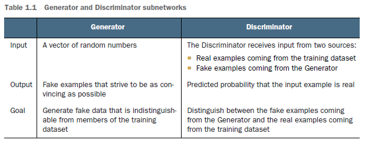
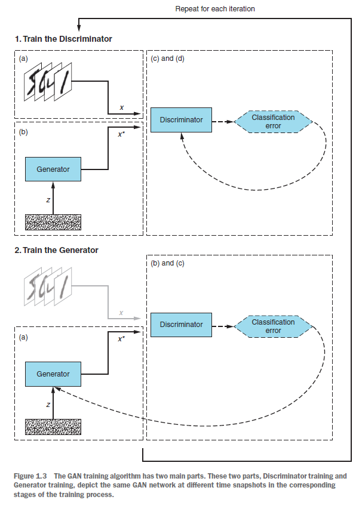

# What is Generative Adversarial Networks GAN

Source:
- [GAN - What is Generative Adversarial Networks GAN?](https://jonathan-hui.medium.com/gan-whats-generative-adversarial-networks-and-its-application-f39ed278ef09)
- [GANs in action: Deep learning with Generative Adversarial Networks](https://www.amazon.com/GANs-Action-learning-Generative-Adversarial/dp/1617295566)

## What does GAN do?
The main focus for GAN (Generative Adversarial Networks) is to generate data from scratch, mostly images but other domains including music have been done.
But the scope of application is far bigger than this.

## Generator and discriminator
GAN composes of two deep networks, the **generator**, and the **discriminator**.
Generative Adversarial Networks (GANs) are a class of machine learning techniques that
consist of two simultaneously trained models: one (the Generator) trained to generate
fake data, and the other (the Discriminator) trained to discern the fake data from real
examples.

### Generator

The word $generative$ indicates the overall purpose of the model: **creating new data**.
The data that a GAN will learn to generate depends on the choice of the training set.

#### Example: How a generator creates images
First, we sample some noise `z` using a normal or uniform distribution.
With $z$ as an input, we use a generator `G` to create an image `x (x=G(z))`.

Conceptually, `z` represents the latent features of the images generated,
for example, the color and the shape.
In Deep learning classification, we don’t control
- the features the model is learning
- the semantic meaning of `z`.
We let the training process to learn it. To discover its meaning,
the most effective way is to plot the generated images and examine ourselves.

### Discriminator

But a generator alone will just create random noise.
Conceptually, the discriminator in GAN provides guidance to the generator on what images to create.

# GAN training algorithm

For each training iteration do:
1. Train the Discriminator:

 a. Take a random real example `x` from the training dataset.

 b. Get a new random noise vector `z` and, using the Generator network, synthesize
a fake example `x*`.

 c. Use the Discriminator network to classify `x` and `x*`.

 d. Compute the classification errors and backpropagate the total error to
update the Discriminator’s trainable parameters, seeking to minimize the
classification errors.

2. Train the Generator:

 a. Get a new random noise vector `z` and, using the Generator network, synthesize
a fake example `x*`.

 b. Use the Discriminator network to classify `x*`.

 c. Compute the classification error and backpropagate the error to update
the Generator’s trainable parameters, seeking to maximize the Discriminator’s
error.

End `for`

 

# A MATHEMATICAL INTRODUCTION TO GAN

Sou